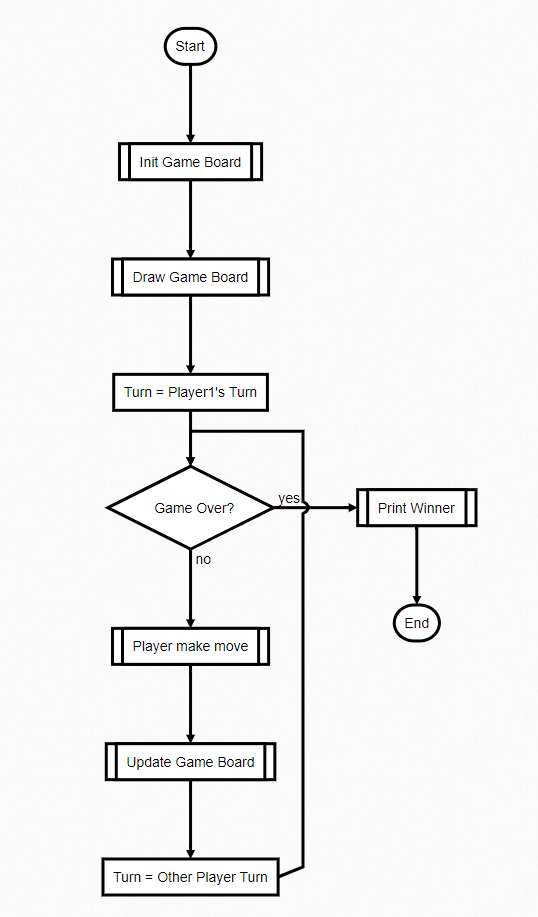

# Lesson 3: Build a Tic-Tac-Toe Game

## Analysis the flow of the game


## Create board
```
def init_board():
    b = [[0,0,0], [0,0,0], [0,0,0]]
    return b
```

or more general
```
WIDTH = 3
HEIGHT = 3

def init_board():
    b = []
    for x in range(0, WIDTH):
        b.append([])
        for y in range(0, HEIGHT):
            b[x].append(0)
    return b
```

## Draw board
```
def print_board(board):
    for y in range(0, 3):
        line = ''
        for x in range(0, 3):
            if board[x][y] == 0:
                line = line + '-'
            elif board[x][y] == 1:
                line = line + 'X'
            elif board[x][y] == 2:
                line = line + 'O'
        print(line)
```

## Player Move
```
def player1_move(board, x, y):
    board[x][y] = 1

def player2_move(board, x, y):
    board[x][y] = 2
```
## Get Player Input
```
def input_player_move(player_number):
    x = input("Player {0}, enter your move X:".format(player_number))
    y = input("Player {0}, enter your move Y:".format(player_number))
    return int(x), int(y)
```

## Game Over?
Condition 1: Somebody won
```
def who_won(board):
    # 0 means no one win, 1 means player 1 wins, 2 means player 2 wins
    result = 0
    # check row
    for y in range(0, 3):
        result = check_winning(board[0][y], board[1][y], board[2][y])
        if result > 0:
            return result
    # check col
    for x in range(0, 3):
        result = check_winning(board[x][0], board[x][1], board[x][2])
        if result > 0:
            return result
    # check diagonal:
    result = check_winning(board[0][0], board[1][1], board[2][2])
    if result > 0:
        return result
    result = check_winning(board[2][0], board[1][1], board[0][2])
    if result > 0:
        return result
    return 0


def check_winning(a, b, c):
    if (a == 1) and (b == 1) and (c == 1):
        return 1
    elif (a == 2) and (b == 2) and (c == 2):
        return 2
    else:
        return 0
```
Condition 2: Game board is full
```
def is_full(board):
    result = True
    for y in range(0, 3):
        for x in range(0, 3):
            if board[x][y] == 0:
                result = False
                break
    return result
```

## Overall Flow
```
def main():
    board = init_board()
    won = 0
    turn = 1
    while (won == 0) and (is_full(board) is False):
        print_board(board)
        print_line()
        x, y = input_player_move(turn)
        if turn == 1:
            player1_move(board, x, y)
        if turn == 2:
            player2_move(board, x, y)
        won = who_won(board)
        if turn == 1:
            turn = 2
        else:
            turn = 1
    print_board(board)
    print_line()
    if won > 0:
        print("Player {0} has won!!".format(won))
    else:
        print("It is a tie.")
```


# Homework
Modify this to play Connect4

Connect4 dimension is:
WIDTH = 7
HEIGHT = 6


## Issue 1
Board size is different from Tic-Tac-Toe

## Issue 2
User will enter the column number (0 to 6)
(that is the x coordinate only)

input_player_move() has to put to the right space because it will drop to the top of other pieces

## Issue 3
Modify is_full() function

## Issue 4
Bonus: Checking winning condition

This is much harder.

## Tips 1:
Start the program with this:
```
WIDTH = 7
HEIGHT = 6


def init_board():
    b = []
    for x in range(0, WIDTH):
        b.append([])
        for y in range(0, HEIGHT):
            b[x].append(0)
    return b
```

The above define two constants WIDTH and HEIGHT, and you can use it throughout the program.  You do not need
to put 7 and 6 all the time in your program.  It is more readable, and you can change the board size in the future.
You should use "WIDTH" and "HEIGHT" in all your for-loops.

## Tips 2:
Modify input_player_move, to start like this:

```
def input_player_move(board, player_number):
    # Python 2.7, You need to change input => raw_input
    input_valid = False
    while input_valid is False:
        x = input("Player {0}, enter your move X:".format(player_number))
        x = int(x)
        ...
        ...
        if (input_valid):
            y = find_top_of_column(board, x)
            ...
            ...
    return x, y

```

And you should write a helper function that finds the top of the column
```
# given a x coordinate, return the first empty space (y-coordinate)
# return -1 if that column is full
def find_top_of_column(board, x):
    result = -1
    ...
    # use for-loop to find out what is the y-coordinate and put it in result
    ...
    return result
```

## Tips 3:
To check the winning condition.  It is harder.

You can comment out the part that calls who_won() function in the main() function, so that you can test 
if other part of your program works.

```
     # won = who_won(board)
```

Then you can modify is_full(), and test if you game works


## Tips 4:
To do who_won() function properly, you need to do:
1. Modify check_winning() to take 4 instead of 3 parameter.
2. In who_won(), you should not hard code the x,y coordinate,
like the original tic-tac-toe, which has a much smaller board.
You should make it work for all WIDTH and HEIGHT.
3. It is useful if you draw the board on a paper, to try to figure our the rules.
4. First, work on 4-in-a-row horizontally, vertically.
5. Next, work on the two diagonals.  Be careful, it can be tricky.  You will find
drawing out the board in white paper helps you.

## Tips 5:
### How to debug (fix problem in your code)

In Pycharm, you can set breakpoint to inspect the variable value, or you can use print,
like this, which will print out the value of x and y.
```
print("{0} {1}".format(x, y))
```

Finally, if it works for you, you can play around the game with your sibling!

Please commit and push the code to github.  Please name your program `connect4.py`


HOMEWORK:  Due by Monday midnight.  Try your best!!

